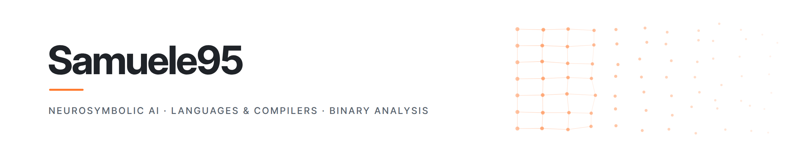

<picture>
  <source media="(prefers-color-scheme: dark)" srcset="assets/banner-dark.png">
  
</picture>

## About

I study how intelligent systems reason — from the symbolic structures of
compilers to the emergent cognition of large language models. The through-line
is that reasoning has a *shape*, and that the shape can be designed: a type
system, an instruction set, and a system prompt are all ways of constraining
what a machine is allowed to conclude.

MSc in Artificial Intelligence & Robotics at UniCam. The work draws on
mathematics and formal theory, cognitive science, psychology, and social theory
— not as decoration, but because binary analysis needs adversarial psychology
as much as it needs formal semantics, and because context engineering turns out
to be a question about how meaning gets constructed from frames. A deep love of
mathematics underlies all of it.

Concretely, that means type theory and formal verification on one side, and on
the other the reading that makes adversarial systems legible: Foucault on power
and knowledge, Bentham's panopticon on surveillance, Weber on rationalisation,
Le Bon on collective behaviour, Malatesta on decentralised organisation. Legal
reasoning belongs in the same list — precedent and interpretation are a
working model of rule-based inference under ambiguity.

## Research

|  | Area | Question |
|:--|:--|:--|
| **01** | **Neurosymbolic AI** Reasoning mechanisms in LLMs, context engineering, and the integration of symbolic structure with neural learning. Less about scaling models than about the machinery that makes their conclusions inspectable. | *How do machines think?* |
| **02** | **Languages & Compilers** Formal language theory, type systems, virtual machine architecture, and the mathematical foundations of computation — from lexing and parsing through IR design to runtime systems and bytecode. | *How do we translate intent into execution?* |
| **03** | **Malware & Binary Analysis** Static and dynamic analysis, reverse engineering, and program behaviour at the lowest level: PE/ELF internals, disassembly, detection signatures, and memory forensics. | *Where intent meets implementation.* |

## Prometheus

> **A prompt is an operator, not a key.** You don't retrieve the right answer by
> finding magic words — you construct it, section by justified section, the way
> you build a circuit.

**[Prometheus](https://github.com/Samuele95/prometheus)** is a build-time
meta-prompting framework for LLM agents: you describe an intent, and it
engineers the artifact end to end — a system prompt, a full agentic loop, or a
multi-step workflow. It works across seven structural prompt shapes and three
modes: build from scratch, refactor an existing artifact, or manage a deployed
agent through a MAPE-K loop that runs between runs and never sits in the
request path. Every artifact it produces ships with a runnable verifier,
defined over three layers — static properties of the artifact, single-run
properties of one output, and cross-run properties visible only across many,
which is where agent regressions hide. It runs entirely at build time, with no
build step and no dependencies, and every technique is traced to a primary
source.

[Repository](https://github.com/Samuele95/prometheus) ·
[Website](https://samuele95.github.io/prometheus/) ·
[Documentation](https://samuele95.github.io/prometheus/documentation-forge.html)

## Selected projects

| Project | What it is |
|:--|:--|
| **[LC3VM](https://github.com/Samuele95/LC3VM)** | A complete LC-3 virtual machine in C, with a simple operating system. |
| **[Logo4J](https://github.com/Samuele95/Logo4J)** | Logo language interpreter in Java, as both a GUI and a console application. |
| **[WebCat](https://github.com/Samuele95/WebCat)** | Automated discovery and classification of website content through unsupervised learning. |
| **[DMS](https://github.com/Samuele95/dms)** | Drive Malware Scan: malware detection and forensic analysis for Tsurugi Linux. |
| **[Computational Fields](https://github.com/Samuele95/computational-fields)** | Interactive simulator for aggregate computing and self-organising programs: field calculus, building blocks, and real-time visualisation. |
| **[Drone Rescue SAR](https://github.com/Samuele95/drone-rescue-SAR)** | Stigmergic multi-drone search & rescue on ROS 2 and Gazebo: pheromone-guided coverage, victim fusion, and task auctioning. |
| **[NEOS](https://github.com/Samuele95/neos)** | Neural Field Operating System: a shell-like command interface for running simulated neural field dynamics on an LLM as a virtual machine. |
| **[RCC Simulator](https://github.com/Samuele95/rcc-renal-cell-carcinoma-simulator)** | Agent-based model of renal cell carcinoma with glucose sensing, sex-stratified treatment response, and Bayesian optimization. |
| **[Parkinson Repast Kit](https://github.com/Samuele95/parkinson-repast-kit)** | Multi-agent based model simulating Parkinson's disease in Repast Simphony. |
| **[MapyReduce](https://github.com/Samuele95/mapyreduce)** | Lightweight, extensible library for MapReduce-like jobs in Python. |

## Tools

What I actually reach for, by area.

**AI & agents:** Python · PyTorch · Transformers · Claude Code · Claude API ·
LangChain · LangGraph · Hugging Face

**Systems & languages:** C · C++ · Java · Haskell · Assembly · Linux · LLVM ·
Flex/Bison · ANTLR

**Binary & forensics:** Ghidra · IDA Pro · x64dbg · Volatility · YARA

## Contact

Interested in neurosymbolic AI, reasoning systems, compiler theory, or the
intersection of computation and cognition? Get in touch.

[smlstr095@gmail.com](mailto:smlstr095@gmail.com) ·
[samuele95.github.io](https://samuele95.github.io)
